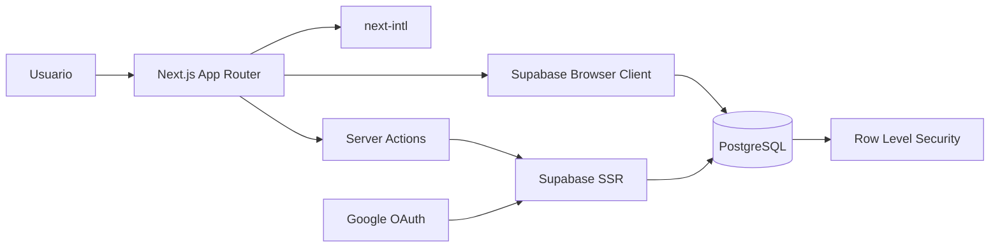

<p align="center">
  
</p>

<h1 align="center">Planora</h1>

<p align="center">
  <strong>Organiza tareas, hábitos, horarios y eventos en un único espacio.</strong><br />
  Una agenda bilingüe, privada y mobile-first que se adapta a tu rutina.
</p>

<p align="center">
  <a href="https://planora-lake-one.vercel.app">
    
  </a>
  
  
  
  
  
</p>

---

## ¿Qué es Planora?

Planora es una aplicación web para convertir una rutina compleja en un horario claro y manejable. Permite combinar tareas puntuales, hábitos recurrentes y eventos, organizarlos por categorías y consultar el progreso semanal desde el móvil o el ordenador.

Cada usuario accede con Google y conserva sus datos en una cuenta privada sincronizada entre dispositivos. La experiencia está diseñada primero para móvil, pero incluye una agenda semanal optimizada para escritorio.

**Aplicación:** [planora-lake-one.vercel.app](https://planora-lake-one.vercel.app)

---

## Funcionalidades

### Tareas y hábitos

- Tareas de una sola vez y hábitos sin fecha de finalización obligatoria.
- Repetición diaria, por días concretos, varias veces por semana o cada cierto número de días, semanas o meses.
- Horario opcional: cualquier momento, mañana, tarde, noche, hora concreta o rango de horas.
- Edición, duplicación y archivado sin perder el historial.
- Emoji, descripción, categoría y color para reconocer cada tarea rápidamente.

### Organización

- Varios horarios independientes, como rutina habitual, vacaciones o época de exámenes.
- Cambio rápido del horario activo.
- Categorías personalizadas con nombre, emoji y selector de color.
- Eventos globales o asociados a un horario, con fecha, hora o día completo.
- Vista de hoy agrupada por momento del día.
- Agenda semanal responsive para móvil y escritorio.

### Seguimiento

- Completar y desmarcar tareas por fecha.
- Historial inmutable con una instantánea del nombre y categoría originales.
- Objetivos semanales y porcentaje de cumplimiento.
- Cálculos adaptados a la zona horaria y al inicio de semana del usuario.

### Experiencia

- Interfaz disponible en castellano e inglés.
- Temas claro, oscuro y automático según el sistema.
- Logos adaptados a cada tema y aplicación instalable mediante manifest web.
- Navegación mobile-first, controles táctiles y diseño responsive.
- Inicio de sesión exclusivamente con Google OAuth.

---

## Arquitectura



Planora utiliza Next.js App Router con Server Components por defecto y componentes cliente únicamente donde hay interacción. Las Server Actions validan las mutaciones con Zod, mientras Supabase gestiona sesiones, PostgreSQL y políticas RLS.

Las recurrencias se calculan bajo demanda. No se generan miles de filas futuras ni se necesita un cron para crear tareas cada día.

---

## Stack técnico

| Área          | Tecnología                                | Uso                                          |
| ------------- | ----------------------------------------- | -------------------------------------------- |
| Framework     | **Next.js 16**                            | App Router, Server Actions, metadata y build |
| Interfaz      | **React 19 + TypeScript**                 | Componentes tipados e interacción            |
| Estilos       | **Tailwind CSS 4 + CSS**                  | Sistema visual responsive y temas            |
| Componentes   | **Radix UI + Lucide**                     | Diálogos accesibles e iconografía            |
| Formularios   | **React + Zod**                           | Estado y validación estructurada             |
| Datos         | **Supabase + PostgreSQL**                 | Persistencia, sesiones y RLS                 |
| Autenticación | **Google OAuth**                          | Acceso único sin contraseñas locales         |
| Idiomas       | **next-intl**                             | Rutas y mensajes en castellano e inglés      |
| Fechas        | **date-fns + date-fns-tz**                | Recurrencias y zonas horarias                |
| Testing       | **Vitest + Testing Library + Playwright** | Pruebas unitarias, UI y E2E                  |
| Hosting       | **Vercel**                                | Despliegue automático desde `main`           |

---

## Estructura del proyecto

```text
planora/
├── public/
│   └── assets/                 # Logos y favicon
├── src/
│   ├── app/                    # Rutas, layouts, API y Server Actions
│   ├── components/             # Shell, navegación y providers
│   ├── features/
│   │   ├── auth/               # Acceso con Google
│   │   └── workspace/          # Tareas, eventos, horarios y ajustes
│   ├── i18n/                   # Configuración de rutas localizadas
│   ├── lib/
│   │   ├── dates/              # Utilidades de zona horaria
│   │   ├── recurrence/         # Motor de recurrencias y progreso
│   │   ├── supabase/           # Clientes browser, server y proxy
│   │   └── validation/         # Esquemas Zod
│   ├── messages/               # Traducciones ES/EN
│   └── types/                  # Tipos generados de la base de datos
├── supabase/
│   └── migrations/             # Esquema, políticas y restricciones
├── tests/                      # Vitest y Testing Library
├── e2e/                        # Pruebas Playwright
└── docs/                       # Arquitectura, seguridad y despliegue
```

---

## Instalación local

### Requisitos

- Node.js 20 o superior.
- Una cuenta de [Supabase](https://supabase.com).
- Un proyecto OAuth en Google Cloud.

### 1. Instalar dependencias

```bash
git clone https://github.com/JoanOliver04/planora.git
cd planora
npm install
```

### 2. Configurar variables de entorno

Copia `.env.example` como `.env.local`:

```env
NEXT_PUBLIC_SUPABASE_URL=https://your-project.supabase.co
NEXT_PUBLIC_SUPABASE_PUBLISHABLE_KEY=your-publishable-key
NEXT_PUBLIC_SITE_URL=http://localhost:3000
SUPABASE_SERVICE_ROLE_KEY=server-only-account-deletion-key
```

`SUPABASE_SERVICE_ROLE_KEY` es exclusivamente de servidor y solo se utiliza para la eliminación verificada de cuentas. Nunca debe exponerse en el cliente.

### 3. Preparar Supabase

1. Ejecuta en orden los archivos de `supabase/migrations`.
2. Activa el proveedor Google en **Authentication → Providers**.
3. Desactiva Email, Phone y cualquier proveedor que no utilices.
4. Añade `http://localhost:3000/auth/callback` a la lista de redirecciones permitidas.

### 4. Configurar Google OAuth

1. Crea un cliente OAuth web en Google Cloud Console.
2. Añade como URI autorizada el callback de Supabase: `https://PROJECT.supabase.co/auth/v1/callback`.
3. Copia el Client ID y el Client Secret en el proveedor Google de Supabase.

### 5. Iniciar la aplicación

```bash
npm run dev
```

Abre [http://localhost:3000](http://localhost:3000).

---

## Comandos

| Comando                 | Descripción                          |
| ----------------------- | ------------------------------------ |
| `npm run dev`           | Servidor de desarrollo con Turbopack |
| `npm run build`         | Build optimizado de producción       |
| `npm start`             | Ejecuta el build de producción       |
| `npm run lint`          | Análisis con ESLint                  |
| `npm run typecheck`     | Comprobación estricta de TypeScript  |
| `npm test`              | Pruebas unitarias y de componentes   |
| `npm run test:coverage` | Tests con informe de cobertura       |
| `npm run test:e2e`      | Flujos E2E con Playwright            |
| `npm run format`        | Formatea el proyecto con Prettier    |
| `npm run db:types`      | Regenera los tipos de Supabase       |

---

## Seguridad

- Row Level Security habilitado en todas las tablas de usuario.
- Políticas `SELECT`, `INSERT`, `UPDATE` y `DELETE` limitadas a `auth.uid()`.
- Claves foráneas compuestas que impiden referencias entre usuarios.
- Sesiones verificadas en servidor mediante Supabase SSR.
- Validación Zod antes de cada mutación.
- Google OAuth limitado a identidad, email y perfil.
- Cabeceras CSP, `X-Frame-Options`, `nosniff` y política de permisos.
- Eliminación de cuenta protegida por sesión, origen y confirmación explícita.
- Contenido del usuario renderizado como texto, nunca como HTML.

Consulta [docs/security.md](docs/security.md) para conocer el modelo completo.

---

## Pruebas y calidad

```bash
npm run lint
npm run typecheck
npm test
npm run test:e2e
npm run build
```

La batería actual cubre el motor de recurrencias, límites de fechas, intervalos, finales de mes, zonas horarias, formato bilingüe, formularios, estados de carga, navegación protegida y experiencia móvil de acceso.

---

## Despliegue

El proyecto está preparado para Vercel y Supabase:

1. Importa el repositorio en Vercel.
2. Configura las mismas variables de entorno de producción.
3. Establece `NEXT_PUBLIC_SITE_URL` con el dominio HTTPS definitivo.
4. Añade el callback de producción a Supabase y Google.
5. Despliega.

Los pushes a `main` generan automáticamente un nuevo despliegue de producción. Las recurrencias no necesitan tareas programadas, por lo que el proyecto puede funcionar dentro de los planes gratuitos de Vercel y Supabase.

Consulta [docs/deployment.md](docs/deployment.md) para ver la lista completa.

---

## Documentación

- [Especificación del producto](docs/product-spec.md)
- [Arquitectura](docs/architecture.md)
- [Modelo de base de datos](docs/database.md)
- [Seguridad](docs/security.md)
- [Estrategia de pruebas](docs/testing.md)
- [Despliegue](docs/deployment.md)
- [Plan de implementación](docs/implementation-plan.md)

---

## Autor

Desarrollado por **Joan Oliver**.

- GitHub: [@JoanOliver04](https://github.com/JoanOliver04)
