<p align="center">
  
</p>

<h1 align="center">Planora</h1>

<p align="center">
  <strong>Tasks, habits, schedules and events in one calm workspace.</strong><br />
  A private, bilingual and mobile-first planner built for flexible routines.
</p>

<p align="center">
  <a href="https://planora-lake-one.vercel.app">
    
  </a>
  
  
  
  
  <a href="https://github.com/JoanOliver04/planora/actions/workflows/ci.yml"></a>
  
</p>

---

## About Planora

Planora turns complex routines into a clear and manageable schedule. It combines one-time tasks, recurring habits and dated events, then organises them by schedule and colour-coded category.

Each user signs in exclusively with Google and gets a private workspace synchronised across devices. The interface is designed mobile-first while providing a spacious weekly planner on desktop.

**Live application:** [planora-lake-one.vercel.app](https://planora-lake-one.vercel.app)

## Features

### Tasks and habits

- One-time tasks and recurring habits.
- Recurrence every day, on selected weekdays, a target number of times per week, or at custom day, week and month intervals.
- Optional start and end dates. Habits can continue indefinitely until the user edits or archives them.
- Optional timing: anytime, morning, afternoon, night, a specific time or a time range.
- Edit, duplicate, archive and restore tasks without losing completion history.
- Confirmation before archiving to prevent accidental removals from the active schedule.
- Emoji, notes, category and colour for quick visual recognition.

### Schedules and calendar

- Multiple independent schedules for regular routines, holidays, exams or any other context.
- Fast switching between active schedules.
- Weekly agenda with previous/next controls, direct date selection and a quick return to the current week.
- The current week is always selected by default.
- Responsive day selector on mobile and full seven-day layout on desktop.
- Custom categories with a name, emoji and colour.
- Global or schedule-specific events with an optional time.

### Focus (Enfoque)

- Flexible concentration sessions: countdown, free stopwatch, or work/break cycles — Pomodoro is optional, not mandatory.
- Fully customizable Focus presets (emoji, intention, durations, cycles, behaviour, structured plan, favourites, archive and reorder) plus optional starter templates.
- Structured session plans with named blocks (timed or open), editable starter ideas for programming, English and piano, live current/next block UI, skip/advance, and planned-vs-actual summary.
- Flexible weekly Focus goals (minutes, sessions or active days; global, category or preset scope) with a primary goal on home, neutral pace hints and recent-week history — no streaks or guilt.
- Focus statistics on Focus home (compact) and in Statistics: daily bars, finish rate, category/task breakdown, goal progress and optional insights only after a minimum sample — pure client aggregates, no heavy chart libraries, no titles/notes sent to product analytics.
- Focus phase alerts via the existing notification stack (in-app toast, system notification through the service worker, soft chime, vibration), scheduled on phase start and cleared on pause/end; optional Screen Wake Lock; permission only on explicit action; honest PWA delivery limits.
- Multi-tab/device Focus continuity: BroadcastChannel (+ localStorage fallback), light server poll, optimistic revision as write authority, view-only follower mode and explicit “Continue here” takeover without creating a second session.
- Offline Focus: continue a known session with local transitions (idempotent queue, no per-second rows); sync in order on reconnect; starting a new session still requires network; remote revision wins on conflict.
- Focus accessibility: desktop keyboard shortcuts (optional), screen-reader phase/status announcements without per-second chatter, on-demand time readout, 44px targets, small-screen and landscape safe areas, reduced-motion respect.
- Focus preferences split by scope: account-synced options (default mode/preset, review, goal visibility) and device-local options (sound volume, vibration, notifications, Wake Lock, compact bar).
- Optional link to a task or habit; finishing a session never auto-completes work unless the user chose that explicitly.
- Quick starts from Today (continue / quick session / next task / last preset) and a secondary timer action in Week and Tasks.
- Robust timer based on timestamps (not per-second DB writes), recovery after reload, and a compact bar while browsing other views.
- Optional end-of-session reflection: private notes, concentration and energy ratings, result label, next step, and parked distractions.
- Park distractions mid-session without pausing; convert one into a Planora task or dismiss it after the session.
- Clear endings: finish and save, cancel and keep partial time, or discard the session permanently with confirmation.
- Focus data is included in portable JSON backup schema v3 (export and atomic restore).

### Progress and history

- Complete or undo tasks for a specific occurrence date.
- Immutable history snapshots preserve the original task and category details.
- Weekly completion targets and progress percentage.
- Date calculations respect the user's timezone and preferred first day of the week.

### Notifications and alarms

- Explicit, user-initiated browser permission flow with a global on/off control.
- Standalone alarms with a custom name, date, time and optional daily or weekly recurrence.
- Relative reminders for tasks and events, including 5, 15 and 30 minutes, 1 or 2 hours, and 1 day before.
- Independent per-device filters for task, event, daily-summary and custom-alarm notifications.
- Separate delivery controls for in-app popups, operating-system notifications, sound and vibration.
- Individual enable/disable, ten-minute snooze and deletion controls for every configured reminder.
- Timezone-safe scheduling, mobile-sized touch targets and responsive forms.
- In-app alerts, sound and vibration require Planora to remain open or active as a PWA. Fully closed web apps can be suspended by the operating system, so system delivery remains subject to browser permissions and platform limits.

### Experience and safety

- Full Spanish and English interface.
- Light, dark and system themes with theme-aware brand assets.
- Installable PWA manifest using the product logo.
- Confirmation dialogs for permanent deletion, archiving, account deletion and sign-out.
- Accessible navigation, keyboard focus states and reduced-motion support.
- Mobile-first touch targets and responsive layouts.
- Google OAuth only; Planora stores no passwords.
- Public no-registration demo, guided onboarding and reusable schedule templates.
- Offline mutation queue, installable PWA and a customizable notification and alarm center.
- Progress dashboard, keyboard-accessible ordering and portable JSON/CSV/ICS exports (including Focus entities in backup v3).
- Archived tasks act as a recoverable trash area, with explicit permanent deletion for the task, its completion history and reminders.
- Privacy-focused Vercel Web Analytics for anonymous, aggregate page-view metrics without tracking cookies or custom product events.
- Sanitized error telemetry and rate-limited sensitive endpoints.

## Product preview

<p align="center">
  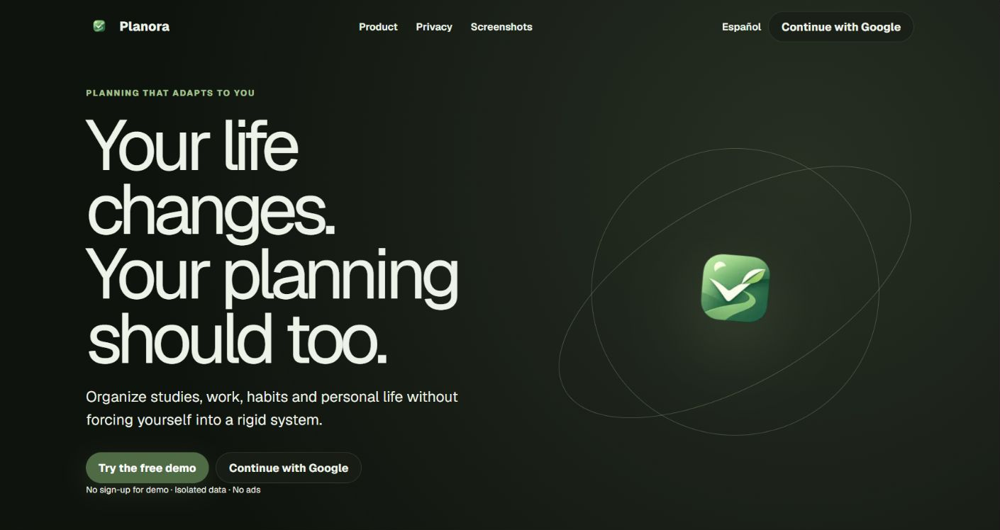
</p>

Planora is a portfolio case study in turning irregular routines into a calm planning system. Recurrence, timezone boundaries, data isolation and offline changes are handled as domain rules rather than visual shortcuts. A public demo makes the complete product easy to evaluate while real workspaces remain private.

## Screenshots

<table>
  <tr>
    <td width="50%" align="center"><strong>Today at a glance</strong><br/>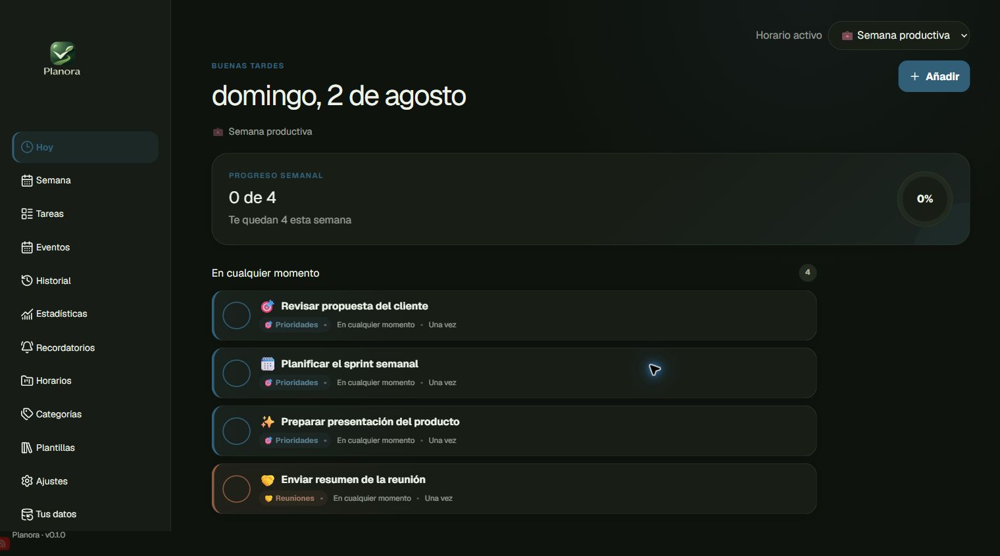</td>
    <td width="50%" align="center"><strong>Weekly planning</strong><br/>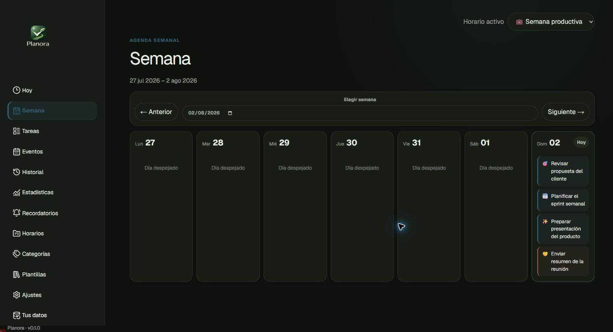</td>
  </tr>
  <tr>
    <td width="50%" align="center"><strong>Task management</strong><br/></td>
    <td width="50%" align="center"><strong>Events</strong><br/>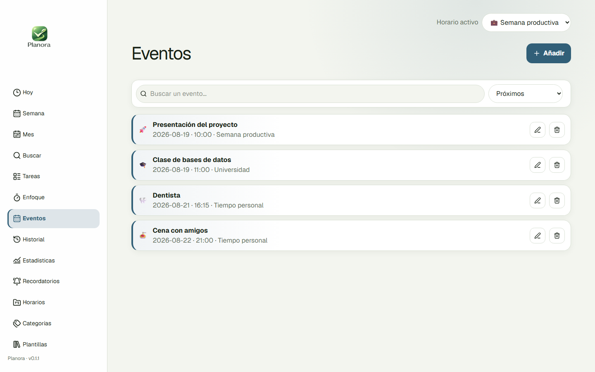</td>
  </tr>
  <tr>
    <td width="50%" align="center"><strong>Completion history</strong><br/>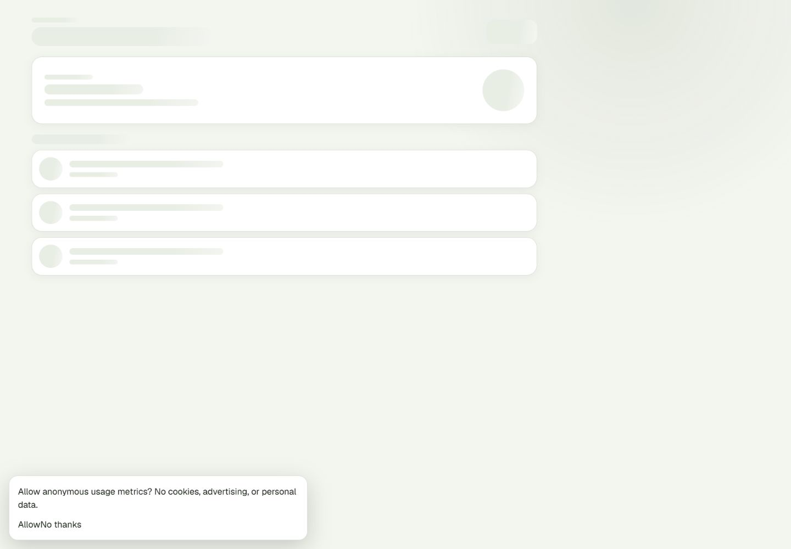</td>
    <td width="50%" align="center"><strong>Deep personalization</strong><br/>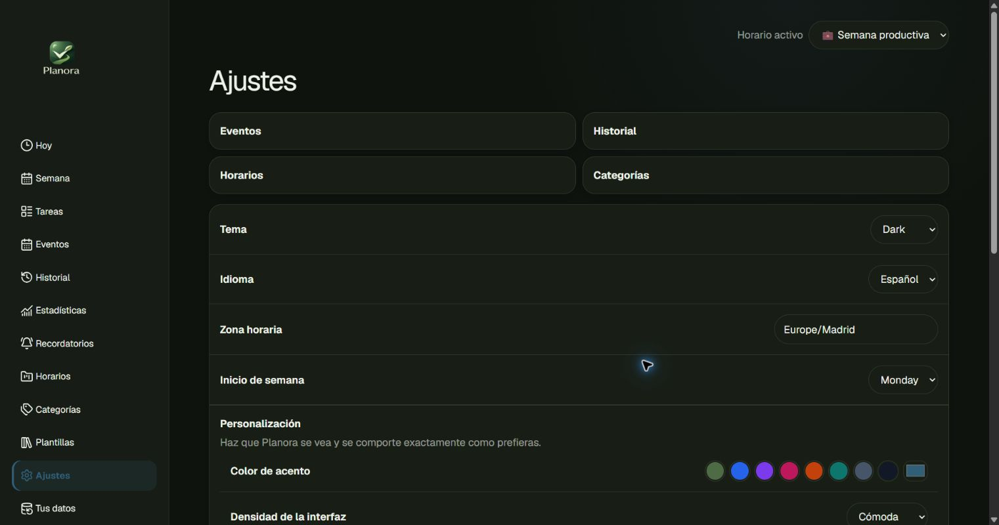</td>
  </tr>
</table>

<details>
<summary><strong>More workspace views</strong></summary>
<br/>
<table>
  <tr>
    <td align="center">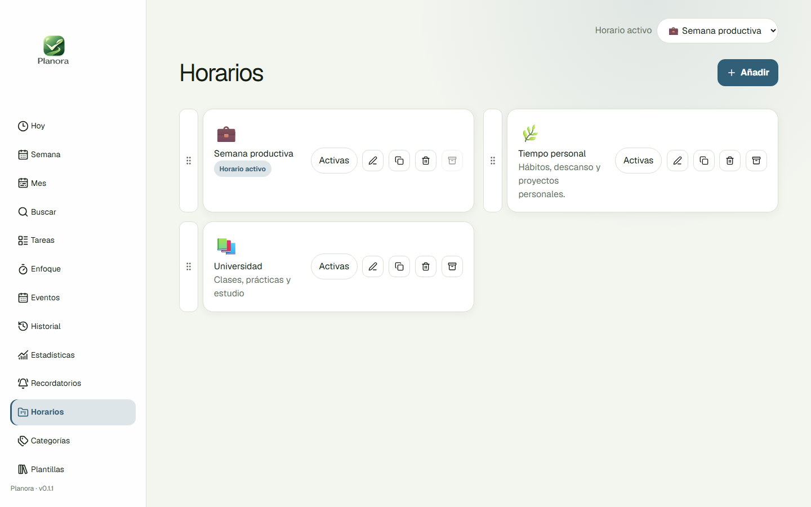<br/><sub>Independent schedules for every context</sub></td>
    <td align="center">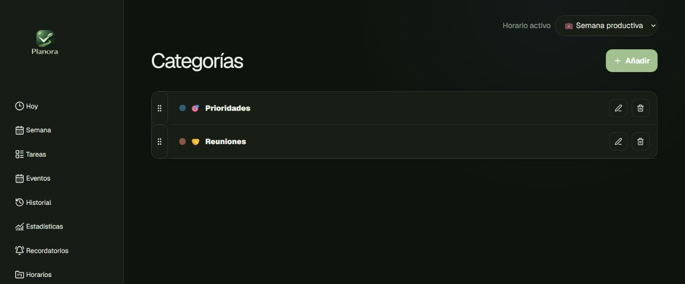<br/><sub>Color-coded categories</sub></td>
  </tr>
</table>
</details>

<details>
<summary><strong>Mobile experience</strong></summary>
<br/>
<p align="center">
  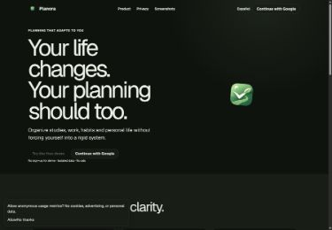
  &nbsp;
  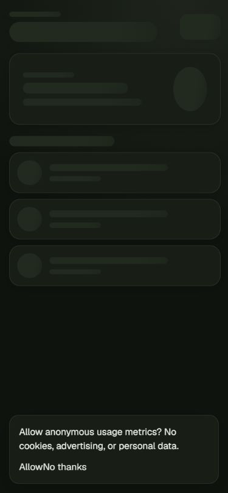
  &nbsp;
  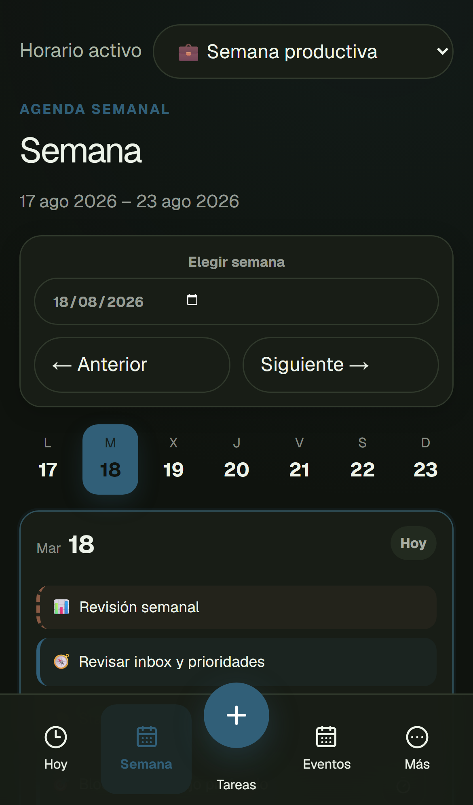
</p>
</details>

## Architecture

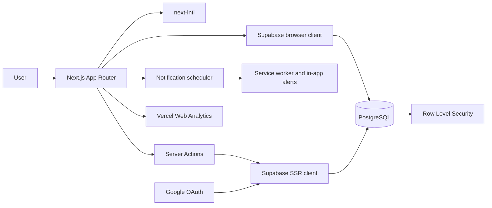

Next.js App Router provides Server Components by default and Client Components only where interaction is required. Server Actions validate every mutation with Zod. Supabase manages Google sessions, PostgreSQL persistence and row-level access policies. Vercel Web Analytics is mounted once in the shared root layout and records automatic page views only on Vercel deployments.

Recurring occurrences are calculated on demand instead of generating unlimited future database rows. Due reminders resolve their task and event copy in two batched lookups instead of issuing one query per notification. This keeps storage predictable, removes the need for scheduled jobs and keeps background refreshes lightweight.

## Technology stack

| Area           | Technology                                | Purpose                                                    |
| -------------- | ----------------------------------------- | ---------------------------------------------------------- |
| Framework      | **Next.js 16**                            | App Router, Server Actions, metadata and production builds |
| UI             | **React 19 + TypeScript**                 | Strictly typed components and interactions                 |
| Styling        | **Tailwind CSS 4 + CSS**                  | Responsive design system and themes                        |
| Components     | **Radix UI + Lucide**                     | Accessible dialogs and icons                               |
| Validation     | **Zod**                                   | Runtime validation for forms and server mutations          |
| Data           | **Supabase + PostgreSQL**                 | Persistence, sessions and RLS                              |
| Authentication | **Google OAuth**                          | Passwordless identity                                      |
| Localisation   | **next-intl**                             | Spanish and English routes and messages                    |
| Dates          | **date-fns + date-fns-tz**                | Recurrence and timezone-safe calculations                  |
| Testing        | **Vitest + Testing Library + Playwright** | Unit, component and end-to-end coverage                    |
| Analytics      | **Vercel Web Analytics**                  | Anonymous, aggregate navigation metrics without cookies    |
| Hosting        | **Vercel**                                | Automatic production deployments from `main`               |

## Project structure

```text
planora/
├── public/assets/              # Logos, PWA artwork and favicon
├── src/
│   ├── app/                    # Routes, layouts, API handlers and Server Actions
│   ├── components/             # Shared shell, navigation and dialogs
│   ├── features/
│   │   ├── auth/               # Google authentication
│   │   └── workspace/          # Tasks, events, schedules and settings
│   ├── i18n/                   # Localised routing configuration
│   ├── lib/
│   │   ├── dates/              # Timezone utilities
│   │   ├── recurrence/         # Recurrence and progress engine
│   │   ├── supabase/           # Browser, server and proxy clients
│   │   └── validation/         # Zod schemas
│   ├── messages/               # Spanish and English translations
│   └── types/                  # Generated database types
├── supabase/migrations/        # Schema, RLS policies and invariants
├── tests/                      # Vitest and Testing Library
├── e2e/                        # Playwright scenarios
└── docs/                       # Product and engineering documentation
```

## Local development

### Requirements

- Node.js 20 or newer.
- A Supabase project.
- A Google Cloud OAuth web client.

### Installation

```bash
git clone https://github.com/JoanOliver04/planora.git
cd planora
npm install
```

Copy `.env.example` to `.env.local` and configure:

```env
NEXT_PUBLIC_SUPABASE_URL=https://your-project.supabase.co
NEXT_PUBLIC_SUPABASE_PUBLISHABLE_KEY=your-publishable-key
NEXT_PUBLIC_SITE_URL=http://localhost:3000
SUPABASE_SERVICE_ROLE_KEY=server-only-account-deletion-key
```

`SUPABASE_SERVICE_ROLE_KEY` is server-only and is used exclusively for verified account deletion. Never expose it to browser code.

Apply every file in `supabase/migrations` in filename order. In Supabase Authentication, enable Google and disable Email, Phone and unused providers. Add the local and production `/auth/callback` URLs to the redirect allow-list.

Start the development server:

```bash
npm run dev
```

Open [http://localhost:3000](http://localhost:3000). Web Analytics is only mounted when Vercel provides `VERCEL_ENV`, so local development and tests do not send page views.

## Available commands

| Command                 | Description                             |
| ----------------------- | --------------------------------------- |
| `npm run dev`           | Start the Turbopack development server  |
| `npm run build`         | Create an optimised production build    |
| `npm start`             | Run the production build                |
| `npm run lint`          | Run ESLint                              |
| `npm run typecheck`     | Run strict TypeScript checks            |
| `npm test`              | Run unit and component tests            |
| `npm run test:coverage` | Generate a coverage report              |
| `npm run test:e2e`      | Run Playwright desktop and mobile flows |
| `npm run format`        | Format the codebase with Prettier       |
| `npm run db:types`      | Regenerate Supabase database types      |

## Security

- RLS is enabled for every user-owned table.
- Database policies are restricted to authenticated sessions and scoped to `(select auth.uid())`.
- Composite foreign keys prevent cross-user references.
- Sensitive mutations include explicit ownership filters in addition to RLS.
- Server sessions are verified through Supabase SSR.
- Zod validates all untrusted mutation input at runtime.
- Google OAuth requests only identity, email and profile information.
- Security headers include CSP, frame denial, MIME sniffing protection, cross-origin resource isolation and a restrictive permissions policy.
- Account deletion requires a valid session, same-origin request, explicit typed confirmation and a per-user rate limit.
- Authenticated pages use private, no-store responses and are never written to the service-worker cache.
- Local workspace snapshots and pending offline changes are cleared after sign-out or account deletion.
- Internal telemetry accepts only small same-origin JSON payloads and sanitizes technical metadata before logging.
- User content is rendered as text and never injected as HTML.
- Web Analytics uses no custom events and receives no task, event, note, category, schedule, account or backup content.
- Valid application URLs contain only controlled locale and view names; user and Supabase identifiers are not placed in page routes.

No application can be guaranteed completely secure. See [docs/security.md](docs/security.md) for the threat model and operational guidance.

## Quality checks

```bash
npm run lint
npm run typecheck
npm test
npm run test:e2e
npm run build
npm audit
```

The suite covers recurrence rules, date boundaries, month endings, timezones, bilingual formatting, forms, loading states, protected navigation, platform metadata, mobile authentication and the single-instance, automatic-only Analytics integration.

## Deployment

Planora is configured for Vercel and Supabase:

1. Import the GitHub repository into Vercel.
2. Configure the production environment variables.
3. Set `NEXT_PUBLIC_SITE_URL` to the final HTTPS domain.
4. Add the production callback to Supabase and Google.
5. Enable **Web Analytics** in the Vercel project dashboard.
6. Deploy and visit several public and authenticated routes.
7. In Analytics, use the environment selector to keep Production and Preview traffic separate, then verify that reported pages contain no sensitive values.

Every push to `main` creates a production deployment automatically. Vercel tracks initial loads and App Router client-side page transitions; localhost remains excluded by the environment guard. Recurrence requires no cron jobs, so the project can run on the free Vercel and Supabase tiers within their usage limits.

See [docs/deployment.md](docs/deployment.md) for the complete checklist.

## Documentation

- [Product specification](docs/product-spec.md)
- [Architecture](docs/architecture.md)
- [Database model](docs/database.md)
- [Security model](docs/security.md)
- [Testing strategy](docs/testing.md)
- [Deployment guide](docs/deployment.md)
- [Backup and restore](docs/backup-and-restore.md)
- [Operations and status](docs/operations.md)
- [Implementation plan](docs/implementation-plan.md)

## Author

Built by **Joan Oliver**.

- GitHub: [@JoanOliver04](https://github.com/JoanOliver04)
