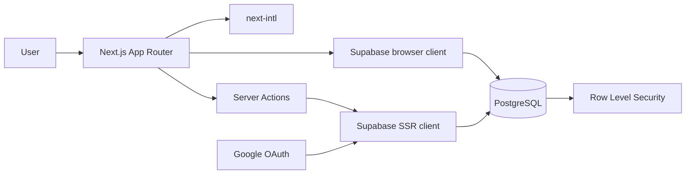

<p align="center">
  
</p>

<h1 align="center">Planora</h1>

<p align="center">
  <strong>Tasks, habits, schedules and events in one calm workspace.</strong><br />
  A private, bilingual and mobile-first planner built for flexible routines.
</p>

<p align="center">
  <a href="https://planora-lake-one.vercel.app">
    
  </a>
  
  
  
  
  
</p>

---

## About Planora

Planora turns complex routines into a clear and manageable schedule. It combines one-time tasks, recurring habits and dated events, then organises them by schedule and colour-coded category.

Each user signs in exclusively with Google and gets a private workspace synchronised across devices. The interface is designed mobile-first while providing a spacious weekly planner on desktop.

**Live application:** [planora-lake-one.vercel.app](https://planora-lake-one.vercel.app)

## Features

### Tasks and habits

- One-time tasks and recurring habits.
- Recurrence every day, on selected weekdays, a target number of times per week, or at custom day, week and month intervals.
- Optional start and end dates. Habits can continue indefinitely until the user edits or archives them.
- Optional timing: anytime, morning, afternoon, night, a specific time or a time range.
- Edit, duplicate, archive and restore tasks without losing completion history.
- Confirmation before archiving to prevent accidental removals from the active schedule.
- Emoji, notes, category and colour for quick visual recognition.

### Schedules and calendar

- Multiple independent schedules for regular routines, holidays, exams or any other context.
- Fast switching between active schedules.
- Weekly agenda with previous/next controls, direct date selection and a quick return to the current week.
- The current week is always selected by default.
- Responsive day selector on mobile and full seven-day layout on desktop.
- Custom categories with a name, emoji and colour.
- Global or schedule-specific events with an optional time.

### Progress and history

- Complete or undo tasks for a specific occurrence date.
- Immutable history snapshots preserve the original task and category details.
- Weekly completion targets and progress percentage.
- Date calculations respect the user's timezone and preferred first day of the week.

### Experience and safety

- Full Spanish and English interface.
- Light, dark and system themes with theme-aware brand assets.
- Installable PWA manifest using the product logo.
- Confirmation dialogs for permanent deletion, archiving, account deletion and sign-out.
- Accessible navigation, keyboard focus states and reduced-motion support.
- Mobile-first touch targets and responsive layouts.
- Google OAuth only; Planora stores no passwords.

## Architecture



Next.js App Router provides Server Components by default and Client Components only where interaction is required. Server Actions validate every mutation with Zod. Supabase manages Google sessions, PostgreSQL persistence and row-level access policies.

Recurring occurrences are calculated on demand instead of generating unlimited future database rows. This keeps storage predictable and removes the need for scheduled jobs.

## Technology stack

| Area           | Technology                                | Purpose                                                    |
| -------------- | ----------------------------------------- | ---------------------------------------------------------- |
| Framework      | **Next.js 16**                            | App Router, Server Actions, metadata and production builds |
| UI             | **React 19 + TypeScript**                 | Strictly typed components and interactions                 |
| Styling        | **Tailwind CSS 4 + CSS**                  | Responsive design system and themes                        |
| Components     | **Radix UI + Lucide**                     | Accessible dialogs and icons                               |
| Validation     | **Zod**                                   | Runtime validation for forms and server mutations          |
| Data           | **Supabase + PostgreSQL**                 | Persistence, sessions and RLS                              |
| Authentication | **Google OAuth**                          | Passwordless identity                                      |
| Localisation   | **next-intl**                             | Spanish and English routes and messages                    |
| Dates          | **date-fns + date-fns-tz**                | Recurrence and timezone-safe calculations                  |
| Testing        | **Vitest + Testing Library + Playwright** | Unit, component and end-to-end coverage                    |
| Hosting        | **Vercel**                                | Automatic production deployments from `main`               |

## Project structure

```text
planora/
├── public/assets/              # Logos, PWA artwork and favicon
├── src/
│   ├── app/                    # Routes, layouts, API handlers and Server Actions
│   ├── components/             # Shared shell, navigation and dialogs
│   ├── features/
│   │   ├── auth/               # Google authentication
│   │   └── workspace/          # Tasks, events, schedules and settings
│   ├── i18n/                   # Localised routing configuration
│   ├── lib/
│   │   ├── dates/              # Timezone utilities
│   │   ├── recurrence/         # Recurrence and progress engine
│   │   ├── supabase/           # Browser, server and proxy clients
│   │   └── validation/         # Zod schemas
│   ├── messages/               # Spanish and English translations
│   └── types/                  # Generated database types
├── supabase/migrations/        # Schema, RLS policies and invariants
├── tests/                      # Vitest and Testing Library
├── e2e/                        # Playwright scenarios
└── docs/                       # Product and engineering documentation
```

## Local development

### Requirements

- Node.js 20 or newer.
- A Supabase project.
- A Google Cloud OAuth web client.

### Installation

```bash
git clone https://github.com/JoanOliver04/planora.git
cd planora
npm install
```

Copy `.env.example` to `.env.local` and configure:

```env
NEXT_PUBLIC_SUPABASE_URL=https://your-project.supabase.co
NEXT_PUBLIC_SUPABASE_PUBLISHABLE_KEY=your-publishable-key
NEXT_PUBLIC_SITE_URL=http://localhost:3000
SUPABASE_SERVICE_ROLE_KEY=server-only-account-deletion-key
```

`SUPABASE_SERVICE_ROLE_KEY` is server-only and is used exclusively for verified account deletion. Never expose it to browser code.

Apply every file in `supabase/migrations` in filename order. In Supabase Authentication, enable Google and disable Email, Phone and unused providers. Add the local and production `/auth/callback` URLs to the redirect allow-list.

Start the development server:

```bash
npm run dev
```

Open [http://localhost:3000](http://localhost:3000).

## Available commands

| Command                 | Description                             |
| ----------------------- | --------------------------------------- |
| `npm run dev`           | Start the Turbopack development server  |
| `npm run build`         | Create an optimised production build    |
| `npm start`             | Run the production build                |
| `npm run lint`          | Run ESLint                              |
| `npm run typecheck`     | Run strict TypeScript checks            |
| `npm test`              | Run unit and component tests            |
| `npm run test:coverage` | Generate a coverage report              |
| `npm run test:e2e`      | Run Playwright desktop and mobile flows |
| `npm run format`        | Format the codebase with Prettier       |
| `npm run db:types`      | Regenerate Supabase database types      |

## Security

- RLS is enabled for every user-owned table.
- `SELECT`, `INSERT`, `UPDATE` and `DELETE` policies are scoped to `auth.uid()`.
- Composite foreign keys prevent cross-user references.
- Sensitive mutations include explicit ownership filters in addition to RLS.
- Server sessions are verified through Supabase SSR.
- Zod validates all untrusted mutation input at runtime.
- Google OAuth requests only identity, email and profile information.
- Security headers include CSP, frame denial, MIME sniffing protection and a restrictive permissions policy.
- Account deletion requires a valid session, same-origin request and explicit typed confirmation.
- User content is rendered as text and never injected as HTML.

No application can be guaranteed completely secure. See [docs/security.md](docs/security.md) for the threat model and operational guidance.

## Quality checks

```bash
npm run lint
npm run typecheck
npm test
npm run test:e2e
npm run build
npm audit
```

The suite covers recurrence rules, date boundaries, month endings, timezones, bilingual formatting, forms, loading states, protected navigation, platform metadata and mobile authentication.

## Deployment

Planora is configured for Vercel and Supabase:

1. Import the GitHub repository into Vercel.
2. Configure the production environment variables.
3. Set `NEXT_PUBLIC_SITE_URL` to the final HTTPS domain.
4. Add the production callback to Supabase and Google.
5. Deploy.

Every push to `main` creates a production deployment automatically. Recurrence requires no cron jobs, so the project can run on the free Vercel and Supabase tiers within their usage limits.

See [docs/deployment.md](docs/deployment.md) for the complete checklist.

## Documentation

- [Product specification](docs/product-spec.md)
- [Architecture](docs/architecture.md)
- [Database model](docs/database.md)
- [Security model](docs/security.md)
- [Testing strategy](docs/testing.md)
- [Deployment guide](docs/deployment.md)
- [Implementation plan](docs/implementation-plan.md)

## Author

Built by **Joan Oliver**.

- GitHub: [@JoanOliver04](https://github.com/JoanOliver04)
